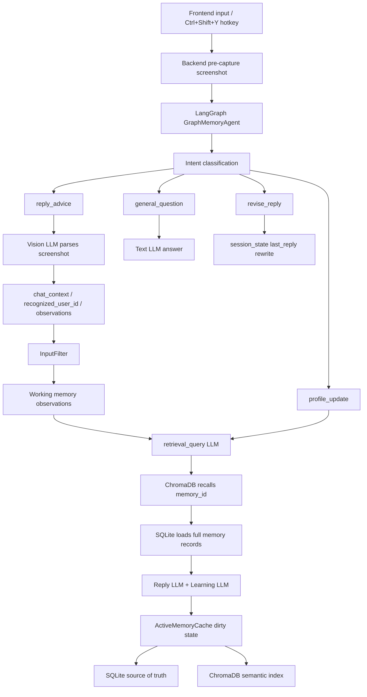

# Context-Aware Long-Term Memory Chat Agent

An AI application engineering project that combines a LangGraph-based agent, long-term memory, working memory, semantic retrieval, fixed-region screenshot capture, and separate text/Vision LLM clients.

The goal is not to train a model. The goal is to demonstrate how to build a production-style AI agent pipeline around state management, memory lifecycle, retrieval, model orchestration, and frontend/backend integration.

## What This Project Does

The system helps generate relationship-aware chat reply suggestions from user intent and, when needed, a screenshot of a chat window.

It can:

- classify user intent;
- capture a fixed desktop region through a global hotkey;
- parse chat screenshots through an independent Vision LLM;
- identify the current chat target when visible;
- retrieve relevant long-term memories;
- maintain short-term working memory observations;
- generate reply advice;
- update long-term memory from new evidence;
- review existing memories and update their status;
- keep SQLite as the source of truth and ChromaDB as a semantic recall index.

## High-Level Architecture

```text
Frontend / Hotkey
    -> Backend pre-capture screenshot
    -> LangGraph GraphMemoryAgent
    -> intent classification
    -> route by intent
        -> general question
        -> revise previous reply
        -> reply advice
        -> profile update
    -> optional Vision LLM parsing
    -> working memory update
    -> retrieval query generation
    -> ChromaDB memory_id recall
    -> SQLite full memory record lookup
    -> reply / learning LLM calls
    -> ActiveMemoryCache dirty writeback
    -> SQLite + ChromaDB synchronization
```



## Main Design Principles

- **SQLite is the source of truth.** Long-term memory is stored and reviewed in SQLite.
- **ChromaDB is only an index.** It recalls `memory_id`; the agent always reloads full memory records from SQLite before sending context to the LLM.
- **Text and Vision models are separated.** Text tasks use `LLMClient`; screenshot parsing uses `VisionLLMClient`.
- **No Dify dependency in the main path.** Legacy Dify files are kept only for historical compatibility.
- **Python orchestrates, LLMs reason.** Python handles routing, persistence, retrieval, cache, and lifecycle. Models produce structured JSON.
- **Dirty memory writeback is centralized.** Learning updates first enter `ActiveMemoryCache`; `sync_dirty_memory` is the only durable writeback step.

## Current Agent Flows

`GraphMemoryAgent` supports four intent routes.

| Intent | Purpose | Uses Screenshot / Vision | Updates Memory |
|---|---|---:|---:|
| `general_question` | Answer a normal user question | No | No |
| `revise_reply` | Rewrite the previous generated reply | No | No |
| `reply_advice` | Analyze a chat window and suggest a reply | Yes | Yes |
| `profile_update` | Manually update a user's profile / memory | No | Yes |

The agent also supports multi-intent input. When several intents are detected, tasks are executed in priority order:

```text
general_question -> revise_reply -> reply_advice -> profile_update
```

## Screenshot and Vision Flow

The frontend no longer needs to stay focused during capture.

1. The user types a request in the frontend.
2. The frontend automatically synchronizes the latest payload to the backend.
3. The user switches to WeChat / QQ / another chat app.
4. The user presses `Ctrl + Shift + Y`.
5. The backend immediately captures the configured screen region.
6. The frontend receives progress: `screenshot captured`.
7. The agent continues running while the frontend shows a loading state.
8. Only if the intent is `reply_advice`, the Vision LLM parses the screenshot.

This avoids calling the Vision model for ordinary questions while still reducing reply-advice latency by performing local screenshot capture before model routing completes.

## Memory System

### Long-Term Memory

Main table: `user_memory`

Important fields:

- `id`
- `user_id`
- `memory_type`
- `content`
- `confidence`
- `memory_status`
- `created_at`
- `updated_at`
- `source_type`
- `source_summary`
- `last_evidence`

Supported memory statuses:

| Status | Meaning |
|---|---|
| `stable` | trusted memory used in normal reply context |
| `pending` | lower-confidence memory kept for review |
| `conflict` | memory that conflicts with existing evidence |
| `discard` | ignored and not used for retrieval context |

Status classification:

```text
has_conflict = true      -> conflict
confidence >= 0.7        -> stable
0.5 <= confidence < 0.7  -> pending
confidence < 0.5         -> discard
```

### Working Memory

Short-term state is stored as an observation queue in `working_memory_observations`.

The agent ages old observations, removes expired items, inserts new observations, and keeps the list bounded. The LLM generates observation content; Python manages lifecycle.

### Session State

`session_state` stores conversational continuity:

- previous user input;
- previous intent;
- previous reply;
- previous chat context;
- previous retrieval query;
- active user id.

This enables `revise_reply` to modify the previous generated reply without running screenshot, retrieval, or learning again.

## Semantic Retrieval

`SemanticRetriever` uses ChromaDB when available.

Default embedding model:

```text
BAAI/bge-base-zh-v1.5
```

Default collection:

```text
user_memory_bge_base_zh_v15
```

Retrieval flow:

```text
retrieval_query
    -> ChromaDB query
    -> memory_id candidates
    -> SQLite get_memory_records(memory_ids)
    -> relevant_memories passed to LLM
```

If ChromaDB or `sentence-transformers` cannot load, the retriever falls back to a lightweight lexical index so local tests still run. The fallback is not intended to be high-quality Chinese retrieval.

## ActiveMemoryCache and Dirty Writeback

Learning outputs do not directly write to SQLite.

Instead:

```text
Learning LLM output
    -> ActiveMemoryCache
    -> dirty_memory_ids
    -> sync_dirty_memory
    -> SQLite durable write
    -> ChromaDB index update
```

This keeps cache state, SQLite state, and semantic index state consistent.

## Project Structure

```text
memory_agent/
  api.py                    FastAPI backend and HTTP endpoints
  graph_agent.py            LangGraph-based main agent
  llm_client.py             OpenAI-compatible text LLM client
  vision_llm_client.py      OpenAI-compatible Vision LLM client
  hotkey_capture.py         Global hotkey capture service
  memory_store.py           SQLite memory/session/working-memory storage
  semantic_retriever.py     ChromaDB semantic retrieval index
  active_memory_cache.py    In-memory active-user memory workspace
  input_filter.py           Empty and duplicate chat filtering
  models.py                 Structured JSON parsing helpers
  state.py                  AgentState TypedDict
  prompts/                  Prompt files for model tasks
  agent.py                  Legacy sequential agent
  dify_client.py            Legacy Dify client

tools/
  screenshot_tool.py        Fixed-region desktop screenshot helper
  chat_screenshot_tool.py   Screenshot + Vision parsing helper

chat-agent/
  src/App.jsx               React frontend
  src/App.css               Frontend styling
  package.json              Vite scripts and frontend dependencies

scripts/
  benchmark_metrics.py      Benchmark and metric collection script
  rebuild_chroma_index.py   Rebuild semantic index from SQLite

benchmarks/
  *.jsonl                   Example benchmark datasets

tests/
  test_graph_agent_local.py
  test_hotkey_capture.py
  test_memory_store.py
  test_semantic_retriever.py
  test_models.py
  test_input_filter.py
```

## Environment Variables

Create a local `.env` file from `.env.example`.

```text
MEMORY_DB_PATH=memory.db
CHROMA_DB_PATH=chroma_memory
CHROMA_COLLECTION_NAME=user_memory_bge_base_zh_v15
EMBEDDING_MODEL_NAME=BAAI/bge-base-zh-v1.5
EMBEDDING_QUERY_INSTRUCTION=为这个句子生成表示以用于检索相关文章：

LLM_API_KEY=your_text_model_api_key
LLM_BASE_URL=https://api.deepseek.com/v1
LLM_MODEL=deepseek-chat
LLM_TEMPERATURE=0.2
LLM_RESPONSE_FORMAT=json_object

VISION_API_KEY=your_vision_model_api_key
VISION_BASE_URL=https://api.openai.com/v1
VISION_MODEL=gpt-4o-mini
VISION_TEMPERATURE=0.0
VISION_TIMEOUT=60
```

Do not commit `.env`.

## Installation

Backend:

```bash
python -m venv .venv
.venv\Scripts\activate
pip install -r requirements.txt
```

Frontend:

```bash
cd chat-agent
npm install
```

## Run the Backend

```bash
python -m uvicorn memory_agent.api:app --reload --host 127.0.0.1 --port 8000
```

The backend exposes:

```text
GET  /health
POST /agent/process
GET  /users/suggest?query=<user_id>
GET  /users/{user_id}/memories
GET  /users/{user_id}/working-memory
GET  /capture/status
POST /capture/context
POST /capture/trigger
POST /capture/cancel
```

## Run the Frontend

```bash
cd chat-agent
npm run dev
```

Open:

```text
http://localhost:5173
```

The frontend automatically synchronizes the latest user input and current user id to the backend. After switching to the chat window, press:

```text
Ctrl + Shift + Y
```

The backend captures the fixed screen region and continues the agent pipeline.

## Run a Local Agent Input

```bash
python main.py examples/sample_input.json
```

## Testing

Run backend tests:

```bash
python -m unittest discover -s tests
```

Run frontend checks:

```bash
cd chat-agent
npm run lint
npm run build
```

## Benchmarking

The benchmark script measures real code-path timings and computes labeled metrics only when benchmark cases include expected labels.

```bash
python scripts/benchmark_metrics.py --output benchmark_metrics_real.json
python scripts/benchmark_metrics.py --cases benchmarks/cache_reuse_cases.jsonl --output benchmark_metrics_cache_real.json
python scripts/benchmark_metrics.py --cases benchmarks/vision_blank_invalid.jsonl --output benchmark_metrics_vision_real.json
```

Use mock mode only to validate the benchmark tool itself:

```bash
python scripts/benchmark_metrics.py --mock --output benchmark_metrics_mock.json
```

Generated benchmark report files are ignored by Git.

Current small-sample benchmark results should be treated as development signals, not final statistical claims. Accuracy metrics such as invalid-chat-window detection require a labeled screenshot dataset.

## Current Engineering Status

Implemented:

- LangGraph-based multi-route agent;
- generic text LLM client;
- independent Vision LLM client;
- fixed-region screenshot capture;
- global hotkey trigger;
- SQLite long-term memory;
- working memory observation queue;
- session state for reply revision;
- ChromaDB semantic recall index;
- BGE Chinese embedding configuration;
- ActiveMemoryCache dirty writeback;
- user-id suggestion and switch confirmation;
- React frontend integration;
- benchmark tooling;
- unit tests for core flows.

Known limitations:

- invalid-chat-window accuracy still needs a labeled screenshot dataset;
- Chinese fallback retrieval is simple and should not be treated as production-grade retrieval;
- screenshot region is fixed in the current frontend version;
- real model latency depends heavily on provider, network, and model choice;
- legacy Dify files remain in the repository but are not used by the main pipeline.

## Why This Project Is Useful

This project demonstrates AI application engineering beyond a plain chatbot:

- multi-stage agent orchestration;
- stateful long-term memory;
- semantic retrieval with source-of-truth separation;
- multimodal model integration;
- local desktop capture tooling;
- structured model output parsing;
- cache consistency and dirty writeback;
- measurable benchmark hooks;
- frontend/backend product integration.
